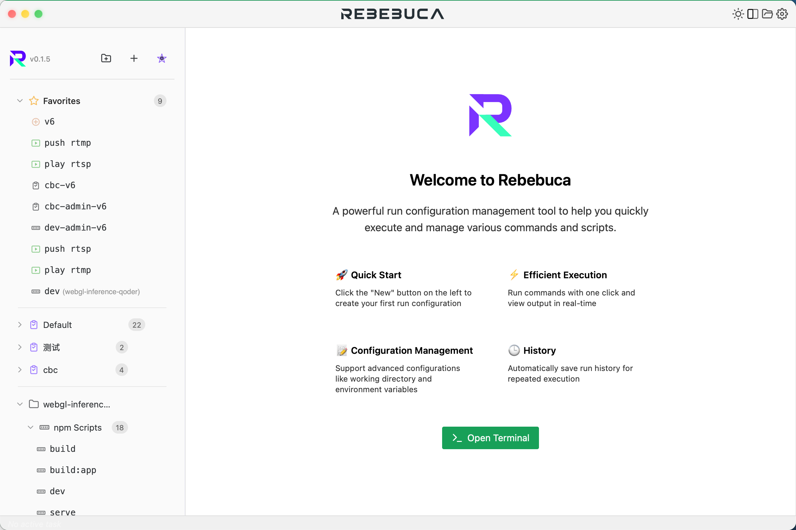
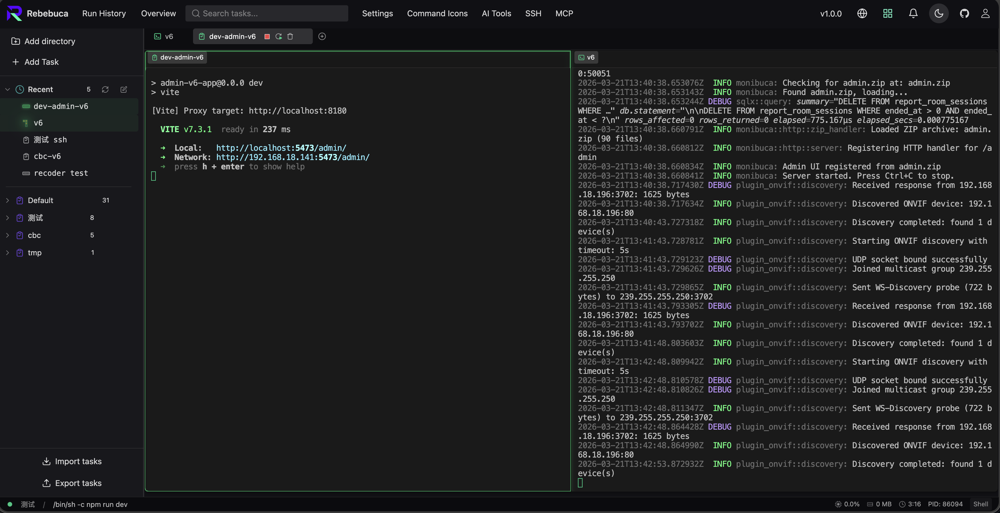

# Rebebuca

<div align="center">
  
  
  <h3>Run Configuration Management Tool</h3>
  
  <p>Launch instantly with a single command — no installation required, just Node.js 18+</p>

  [](https://www.npmjs.com/package/rebebuca)
  [](https://nodejs.org/)
  [](https://vuejs.org/)
  [](https://www.typescriptlang.org/)
  [](LICENSE)

  **[Official Website](https://rebebuca.com)** | [中文文档](README_CN.md) | English
</div>

---

## 🚀 Quick Start

```bash
npx rebebuca
```

That's it! Rebebuca starts a local web server and opens your browser automatically.

### Options

```bash
npx rebebuca --port 8080          # Custom port (default: 3000)
npx rebebuca --host 0.0.0.0       # Expose on all network interfaces
npx rebebuca --no-open            # Don't open browser automatically
npx rebebuca --help               # Show all options
```

> **Requirements:** Node.js 18 or higher

---

## ✨ Features

- 🚀 **Quick Launch** - Create and run configurations with one click, no need to memorize complex commands
- ⚡ **Real-time Output** - View command execution results in real-time with multi-tab support
- 📝 **Configuration Management** - Support for advanced options like working directory and environment variables
- 🕒 **History Tracking** - Automatically save run history for easy re-execution
- 🎨 **Modern UI** - Beautiful dark theme interface built with Naive UI
- 💾 **Persistent Storage** - Configurations and history data are automatically saved and persist across restarts
- 🖥️ **Cross-platform** - Supports Windows, macOS, and Linux
- 🌐 **Web-based** - Runs entirely in your browser via a local Node.js HTTP server

## 📸 Preview

<div align="center">
  
  <br><br>
  
</div>

## 🛠️ Tech Stack

### Frontend
- **Vue 3** - Progressive JavaScript framework
- **TypeScript** - Type-safe JavaScript superset
- **Naive UI** - Modern Vue 3 component library
- **Pinia** - Lightweight state management library for Vue
- **Vite** - Next generation frontend build tool

### Backend (Node.js)
- **Node.js** - HTTP + WebSocket server (replaces Rust/Tauri)
- **node-pty** - Native PTY terminal emulation
- **ws** - High-performance WebSocket library

## 📦 Development Setup

### Prerequisites

- **Node.js** >= 18.0.0
- **npm** or **pnpm**

### Development Server

1. **Install dependencies**
```bash
npm install
```

2. **Start development server** (mock backend)
```bash
npm run dev:web
```

3. **Start with Node.js backend** (full server mode)
```bash
npm run dev:server
```

4. **Build the npm-publishable bundle**
```bash
npm run build:server-app
```


   - **Environment Variables**: Additional environment variables (optional)
3. Click **"Save"** to complete

### Running Configurations

- Click the **play button** ▶️ next to a configuration in the left sidebar
- The command will execute in a new tab, showing real-time output
- Multiple configurations can run simultaneously

### Managing Tabs

- **Restart**: Re-execute the current configuration
- **Stop**: Terminate the running command
- **Clear**: Clear console output
- **Scroll to Bottom**: Jump to the latest output
- **Edit**: Modify the configuration associated with the current tab

### Run History

- The right panel displays recent run history
- Click the **rerun button** to quickly execute historical commands
- Support for clearing history

## 📁 Project Structure

```
rebebuca/
├── src/                      # Vue frontend code
│   ├── App.vue              # Main application component
│   ├── main.ts              # Application entry point
│   ├── components/          # Vue components
│   │   └── RunConfigDialog.vue
│   └── stores/              # Pinia state management
│       └── runConfig.ts
├── src-tauri/               # Tauri backend code
│   ├── src/
│   │   ├── main.rs         # Rust main program
│   │   └── lib.rs          # Library code
│   ├── tauri.conf.json     # Tauri configuration
│   └── Cargo.toml          # Rust dependency configuration
├── public/                  # Static assets
├── index.html              # HTML template
├── vite.config.ts          # Vite configuration
├── tsconfig.json           # TypeScript configuration
└── package.json            # Project dependencies
```

## 🔨 Building

### Development Mode
```bash
# Start development server (with hot reload)
pnpm tauri:dev
```

### Local Production Build
```bash
# Build production version
pnpm tauri build
```

Build artifacts are located in the `src-tauri/target/release/bundle/` directory.

### GitHub Actions Automated Builds

The project is configured with GitHub Actions workflows that automatically build for the following platforms:

- **macOS**: Universal Binary (supports both Intel and Apple Silicon)
  - Generates `.app` and `.dmg` files
- **Windows**: x64 executables
  - Generates `.exe` (NSIS installer) and `.msi` installer

#### Triggering Builds

1. **Push to main branch**: Automatically builds all platforms
2. **Create version tag**: Creating a tag in `v*` format (e.g., `v0.1.0`) will automatically build and create a GitHub Release

```bash
# Release a new version
git tag v0.1.0
git push origin main
git push origin v0.1.0
```

3. **Manual trigger**: Run builds manually from the GitHub Actions page

After the build completes, you can download artifacts from the Actions page or from the Releases page for published versions.

For detailed information, see [.github/workflows/README.md](.github/workflows/README.md).

### Platform-specific Builds

- **macOS**: Generates `.app` and `.dmg` files
- **Windows**: Generates `.exe` and `.msi` installer
- **Linux**: Generates `.AppImage` and `.deb` packages (requires local build)

## 🤝 Contributing

Contributions are welcome! Please follow these steps:

1. Fork this repository
2. Create a feature branch (`git checkout -b feature/AmazingFeature`)
3. Commit your changes (`git commit -m 'Add some AmazingFeature'`)
4. Push to the branch (`git push origin feature/AmazingFeature`)
5. Open a Pull Request

## 📝 Development Guidelines

### Recommended IDE Setup

- [VS Code](https://code.visualstudio.com/) 
- Extensions:
  - [Vue - Official](https://marketplace.visualstudio.com/items?itemName=Vue.volar)
  - [Tauri](https://marketplace.visualstudio.com/items?itemName=tauri-apps.tauri-vscode)
  - [rust-analyzer](https://marketplace.visualstudio.com/items?itemName=rust-lang.rust-analyzer)
  - [TypeScript Vue Plugin (Volar)](https://marketplace.visualstudio.com/items?itemName=Vue.vscode-typescript-vue-plugin)

### Code Standards

- Use TypeScript strict mode
- Follow Vue 3 Composition API best practices
- Use `<script setup>` syntax sugar
- Keep code clean and maintainable

## 📄 License

This project is licensed under the GNU General Public License v3.0 - see the [LICENSE](LICENSE) file for details.

## 🙏 Acknowledgments

- [Tauri](https://tauri.app/) - Excellent desktop application framework
- [Vue.js](https://vuejs.org/) - Progressive JavaScript framework
- [Naive UI](https://www.naiveui.com/) - Beautiful Vue 3 component library
- [Vite](https://vitejs.dev/) - Fast frontend build tool

---

<div align="center">
  <p>Made with ❤️</p>
  <p>If this project helps you, please give it a ⭐️</p>
</div>

