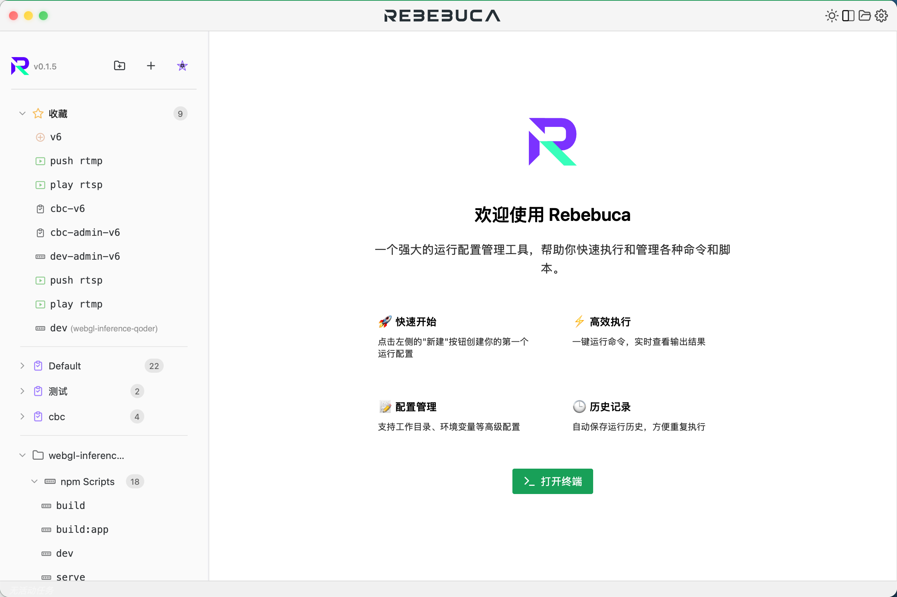
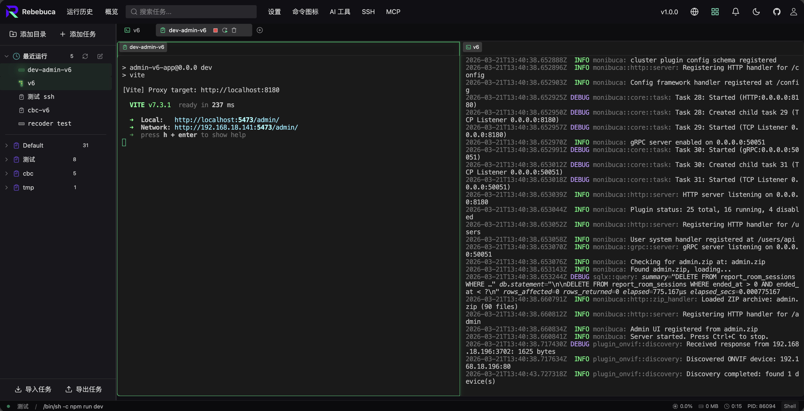

# Rebebuca

<div align="center">
  
  
  <h3>强大的运行配置管理工具</h3>
  
  <p>一个现代化的运行配置管理工具，通过 npx 即可启动，无需安装</p>

  [](https://www.npmjs.com/package/rebebuca)
  [](https://vuejs.org/)
  [](https://www.typescriptlang.org/)
  [](LICENSE)

  **[官方网站](https://rebebuca.com)** | 中文 | [English](README.md)
</div>

---

## ✨ 功能特点

- 🚀 **快速启动** - 一键创建和运行配置，无需记忆复杂命令
- ⚡ **实时输出** - 实时查看命令执行结果，支持多标签页同时运行
- 📝 **配置管理** - 支持工作目录、环境变量等高级配置选项
- 🕒 **历史记录** - 自动保存运行历史，方便重复执行
- 🎨 **现代化 UI** - 基于 Naive UI 的精美暗色主题界面
- 💾 **持久化存储** - 配置和历史数据自动保存，重启不丢失
- 🖥️ **跨平台** - 支持 Windows、macOS 和 Linux
- 🖥️ **终端选择** - 可选择首选的系统终端来执行外部命令

## 📸 预览

<div align="center">
  
  <br><br>
  
</div>

## 🛠️ 技术栈

### 前端
- **Vue 3** - 渐进式 JavaScript 框架
- **TypeScript** - 类型安全的 JavaScript 超集
- **Naive UI** - 现代化的 Vue 3 组件库
- **Pinia** - Vue 的轻量级状态管理库
- **Vite** - 下一代前端构建工具

### 后端
- **Node.js** - HTTP + WebSocket 服务（node-server）
- **Nuxt 3** - 前端静态构建

## 📦 安装与开发

### 前置要求

- **Node.js** >= 18.0.0
- **pnpm** >= 8.0.0

### 开发环境

1. **安装依赖**
```bash
pnpm install
```

2. **启动开发**
```bash
pnpm dev:server
```

## 🚀 使用指南

### 创建运行配置

1. 点击左侧边栏的 **"新建"** 按钮
2. 填写配置信息：
   - **名称**: 配置的显示名称
   - **命令**: 要执行的命令
   - **工作目录**: 命令执行的目录（可选）
   - **环境变量**: 额外的环境变量（可选）
3. 点击 **"保存"** 完成创建

### 运行配置

- 在左侧配置列表中，点击配置旁的 **运行按钮** ▶️
- 命令将在新标签页中执行，实时显示输出结果
- 可以同时运行多个配置

### 管理标签页

- **重启**: 重新执行当前配置
- **停止**: 终止正在运行的命令
- **清空**: 清除控制台输出
- **滚动到底部**: 快速跳转到最新输出
- **编辑**: 修改当前标签页对应的配置

### 运行历史

- 右侧面板显示最近的运行历史
- 点击 **重新运行** 按钮快速执行历史命令
- 支持清空历史记录

## 📁 项目结构

```
rebebuca/
├── app/                      # Nuxt 3 应用（前端）
│   └── pages/
├── src/                      # 共享 Vue/TS 代码
│   ├── components/          # Vue 组件
│   └── stores/              # Pinia 状态管理
├── node-server/              # Node.js HTTP + WebSocket 服务
│   ├── server.js
│   └── handlers/
├── bin/rebebuca.js           # CLI 入口（npx rebebuca）
├── dist/server/              # 构建后的静态 UI（Nuxt 生成）
├── public/                   # 静态资源
└── package.json              # 项目依赖
```

## 🔨 构建

### 开发
```bash
pnpm dev:server
```

### 生产构建（用于 npm / npx rebebuca）
```bash
pnpm run build:server-app
```
将 Nuxt 静态构建输出到 `dist/server`，由 Node 服务提供。

### 发布到 npm

推出版本 tag 后，由 GitHub Actions 自动构建并发布到 npm：

```bash
./scripts/release.sh 0.5.6   # 更新版本、提交、打 tag v0.5.6、推送
```
CI 会执行 `build:server-app` 后执行 `pnpm publish`。需在仓库 secrets 中配置 `NPM_TOKEN`。

## 🤝 贡献

欢迎贡献代码！请遵循以下步骤：

1. Fork 本仓库
2. 创建特性分支 (`git checkout -b feature/AmazingFeature`)
3. 提交更改 (`git commit -m 'Add some AmazingFeature'`)
4. 推送到分支 (`git push origin feature/AmazingFeature`)
5. 开启 Pull Request

## 📝 开发建议

### 推荐的 IDE 设置

- [VS Code](https://code.visualstudio.com/) 
- 扩展插件:
  - [Vue - Official](https://marketplace.visualstudio.com/items?itemName=Vue.volar)
  - [TypeScript Vue Plugin (Volar)](https://marketplace.visualstudio.com/items?itemName=Vue.vscode-typescript-vue-plugin)

### 代码规范

- 使用 TypeScript 严格模式
- 遵循 Vue 3 Composition API 最佳实践
- 使用 `<script setup>` 语法糖
- 保持代码简洁和可维护性

## 📄 许可证

本项目采用 GNU 通用公共许可证 v3.0 - 查看 [LICENSE](LICENSE) 文件了解详情。

## 🙏 致谢

- [Vue.js](https://vuejs.org/) - 渐进式 JavaScript 框架
- [Nuxt](https://nuxt.com/) - 基于 Vue 的静态/构建方案
- [Naive UI](https://www.naiveui.com/) - 精美的 Vue 3 组件库
- [Vite](https://vitejs.dev/) - 快速的前端构建工具

---

<div align="center">
  <p>用 ❤️ 制作</p>
  <p>如果这个项目对你有帮助，请给它一个 ⭐️</p>
</div>
