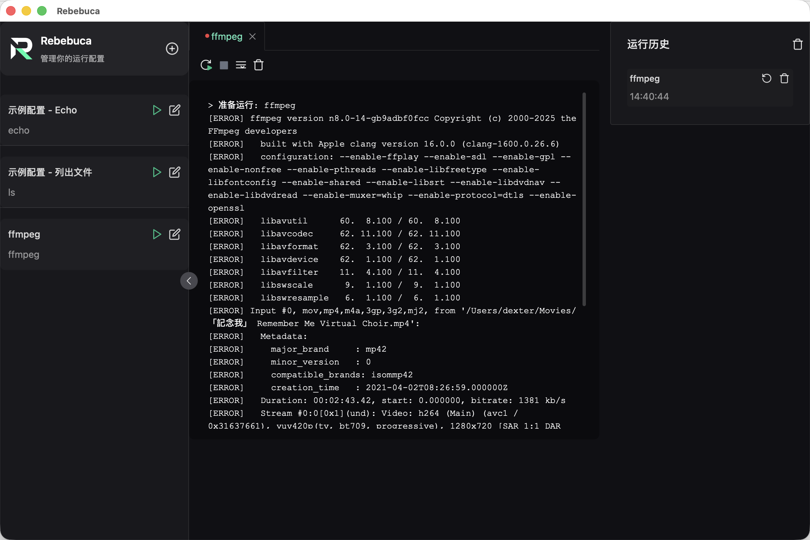

# Rebebuca

<div align="center">
  
  
  <h3>强大的运行配置管理工具</h3>
  
  <p>一个现代化的桌面应用，帮助开发者快速管理和执行各种命令与脚本</p>

  [](https://github.com/langhuihui/rebebuca/actions)
  [](https://github.com/zed-industries/zed)
  [](https://www.rust-lang.org/)
  [](LICENSE)

  中文 | [English](README.md)
</div>

---

## ✨ 功能特点

- 🚀 **快速启动** - 一键创建和运行配置，无需记忆复杂命令
- ⚡ **实时输出** - 实时查看命令执行结果，支持多标签页同时运行
- 📝 **配置管理** - 支持工作目录、环境变量等高级配置选项
- 🕒 **历史记录** - 自动保存运行历史，方便重复执行
- 🎨 **现代化 UI** - 基于 GPUI 的精美原生界面
- 💾 **持久化存储** - 配置和历史数据自动保存，重启不丢失
- 🖥️ **跨平台** - 支持 Windows、macOS 和 Linux
- ⚡ **高性能** - 纯 Rust 实现，原生性能

## 📸 预览

<div align="center">
  
</div>

## 🛠️ 技术栈

### 应用
- **GPUI** - 现代化的 Rust GUI 框架，用于原生桌面应用
- **Rust** - 系统级编程语言，保证性能和安全
- **Tokio** - Rust 异步运行时
- **Serde** - 数据序列化框架

### 架构
- **纯 Rust** - 无 Web 技术，无 JavaScript，无 HTML/CSS
- **原生性能** - 通过 GPUI 直接操作系统集成
- **小体积** - ~12MB vs Web 方案的 ~20MB+

## 📦 安装

### 前置要求

- **Rust** >= 1.70.0
- **Cargo** (随 Rust 一起安装)

### 开发环境安装

1. **克隆项目**
```bash
git clone https://github.com/yourusername/rebebuca.git
cd rebebuca
```

2. **构建应用**
```bash
cargo build
```

3. **运行应用**
```bash
cargo run
```

## 🚀 使用指南

### 创建运行配置

1. 点击左侧边栏的 **"新建"** 按钮
2. 填写配置信息：
   - **名称**: 配置的显示名称
   - **命令**: 要执行的命令
   - **工作目录**: 命令执行的目录（可选）
   - **环境变量**: 额外的环境变量（可选）
3. 点击 **"保存"** 完成创建

### 运行配置

- 在左侧配置列表中，点击配置旁的 **运行按钮** ▶️
- 命令将在新标签页中执行，实时显示输出结果
- 可以同时运行多个配置

### 管理标签页

- **重启**: 重新执行当前配置
- **停止**: 终止正在运行的命令
- **清空**: 清除控制台输出
- **滚动到底部**: 快速跳转到最新输出
- **编辑**: 修改当前标签页对应的配置

### 运行历史

- 右侧面板显示最近的运行历史
- 点击 **重新运行** 按钮快速执行历史命令
- 支持清空历史记录

## 📁 项目结构

```
rebebuca/
├── Cargo.toml                   # 工作空间配置
├── crates/
│   ├── rebebuca-core/          # 核心业务逻辑
│   │   ├── src/
│   │   │   ├── lib.rs         # 主库文件
│   │   │   ├── models.rs      # 数据模型
│   │   │   ├── process.rs     # 进程管理
│   │   │   └── storage.rs     # 数据持久化
│   │   └── Cargo.toml
│   ├── rebebuca-ui/            # GPUI UI 组件
│   │   ├── src/
│   │   │   ├── lib.rs         # UI 库
│   │   │   ├── app.rs         # 主应用视图
│   │   │   ├── theme.rs       # 主题系统
│   │   │   ├── ansi.rs        # ANSI 颜色支持
│   │   │   └── components/    # UI 组件
│   │   └── Cargo.toml
│   └── rebebuca-app/           # 主应用入口
│       ├── src/
│       │   └── main.rs        # 应用入口点
│       └── Cargo.toml
├── assets/                      # 应用资源
│   ├── icons/                  # 应用图标
│   └── themes/                 # 主题文件
└── README.md
```

## 🔨 构建

### 开发模式
```bash
# 构建并运行开发模式
cargo run
```

### 发布构建
```bash
# 构建优化版本
cargo build --release
```

可执行文件位于 `target/release/rebebuca`。

### macOS 应用打包（带图标）

在 macOS 上，要显示自定义 Dock 图标，需要将应用打包成 `.app` bundle：

```bash
# 构建 macOS 应用 bundle（包含图标配置）
./build-macos-app.sh
```

这会创建 `Rebebuca.app`，包含：
- 配置好的 `Info.plist`
- 应用图标 (`icon.icns`)
- 正确的 bundle 结构

然后可以通过以下方式运行：
```bash
open Rebebuca.app
```

**注意**：直接运行 `cargo run` 时，应用不会以 bundle 形式运行，因此 Dock 图标可能显示为系统默认图标。使用打包脚本创建 `.app` bundle 后即可显示自定义图标。

### 跨平台构建

应用可以构建为不同平台：

```bash
# 构建当前平台
cargo build --release

# 构建特定目标（需要安装目标）
cargo build --release --target x86_64-unknown-linux-gnu
cargo build --release --target x86_64-pc-windows-gnu
cargo build --release --target aarch64-apple-darwin
```

## 🤝 贡献

欢迎贡献代码！请遵循以下步骤：

1. Fork 本仓库
2. 创建特性分支 (`git checkout -b feature/AmazingFeature`)
3. 提交更改 (`git commit -m 'Add some AmazingFeature'`)
4. 推送到分支 (`git push origin feature/AmazingFeature`)
5. 开启 Pull Request

## 📝 开发建议

### 推荐的 IDE 设置

- [VS Code](https://code.visualstudio.com/) 
- 扩展插件:
  - [rust-analyzer](https://marketplace.visualstudio.com/items?itemName=rust-lang.rust-analyzer)
  - [CodeLLDB](https://marketplace.visualstudio.com/items?itemName=vadimcn.vscode-lldb) (用于调试)

### 代码规范

- 使用 Rust 标准格式化 (`cargo fmt`)
- 遵循 Rust 命名约定
- 使用 `cargo clippy` 进行代码检查
- 编写全面的文档
- 为新功能添加测试

## 🐛 问题反馈

如果你发现了 bug 或有功能建议，请[创建 Issue](https://github.com/yourusername/rebebuca/issues/new)。

## 📄 许可证

本项目采用 GNU 通用公共许可证 v3.0 - 查看 [LICENSE](LICENSE) 文件了解详情。

## 🙏 致谢

- [GPUI](https://github.com/zed-industries/zed) - 现代化 Rust GUI 框架
- [Rust](https://www.rust-lang.org/) - 系统级编程语言
- [Tokio](https://tokio.rs/) - Rust 异步运行时
- [Serde](https://serde.rs/) - 序列化框架

---

<div align="center">
  <p>用 ❤️ 和 Rust 制作</p>
  <p>如果这个项目对你有帮助，请给它一个 ⭐️</p>
</div>